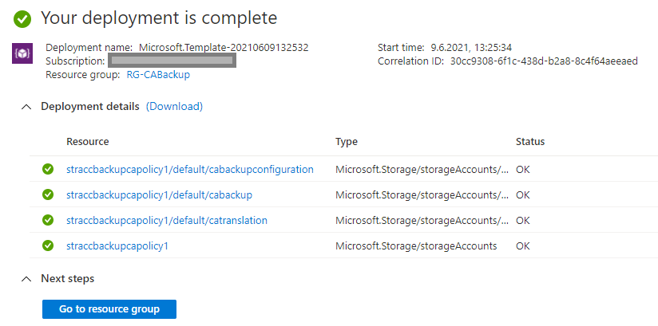
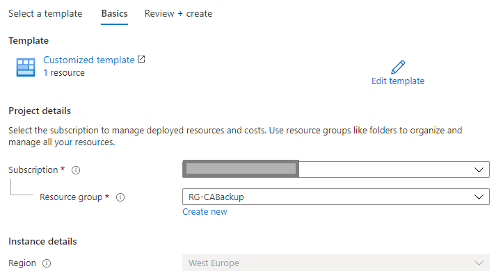
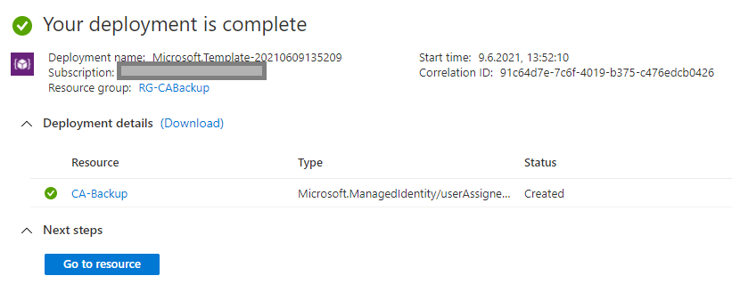
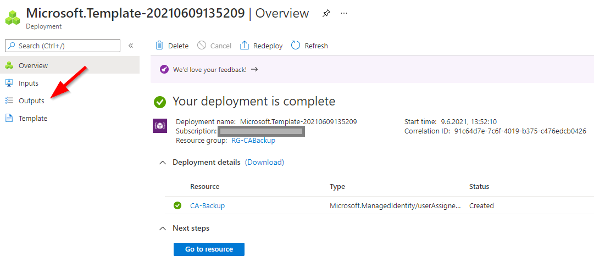
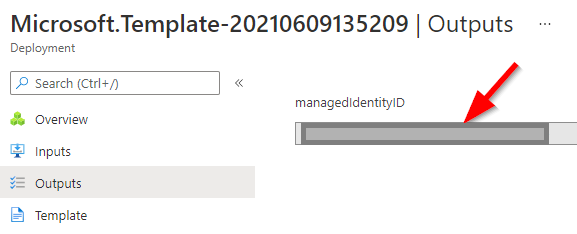
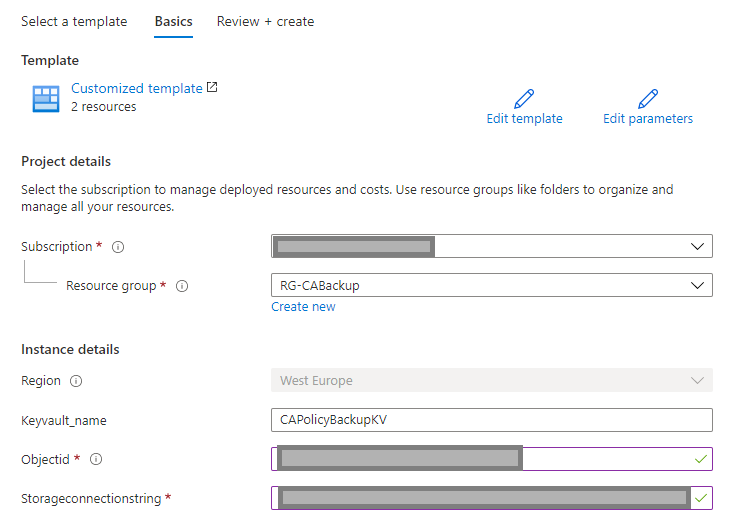
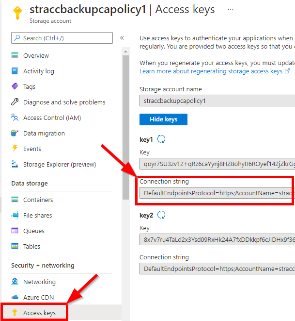
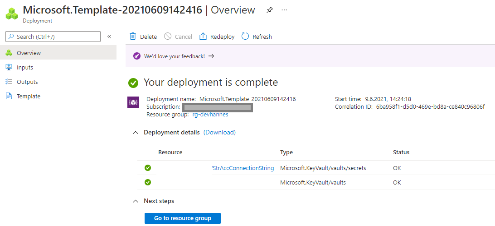

# Welcome to my CABackup solution.
You can find here the installation process for the whole solution.
The monthley fee for that solution (Microsoft consumption) is aprox 50€

#### 1. Okay let's start, to install the solution deploy the Azure storage account first:

That deployment includes the Azure storage account and the required Azure storage tables
* cabackup
* catranslation
* cabackupconfiguration

> #### Deployment input:
> <b style='color:red'>!IMPORTANT!</b> please select an existing resourcegroup or define a new one!

> #### Result:

#### 2. Next step is the user assigned managed identity deployment

That deployment step includes the Azure user assigned managed identits deployment, which is important for the whole solution.
Keep in mind, we have to copy the user assigned managed identity 'client id' when the deployment is finished!

> #### Deployment input:
> <b style='color:red'>!IMPORTANT!</b> please select the resource group created bevor

> #### Result:

> #### <b style='color:orange'>Now an important part!</b>
> Please copy the output from the deployment, we need that information in the next steps!

Than:

#### 3. Now we can deploy the keyvault resource

That deployment step includes the Azure keyvault deployment, which is important for the Web Application.

> #### Deployment input:
> <b style='color:red'>!IMPORTANT!</b>   
> * Please select the resource group created bevor
> * Add the object id from the user assigned managed identity
> * Add the Azure storage account connection string

> You can find the Storageconnection string, when you open the deployed storage account and select the following:

> #### Result:

#### 4. Now we can deploy the Azure logic apps including the connectors

That deployment step includes the Azure logicapp and connectors deployment, which represent the basic infrastructure.

