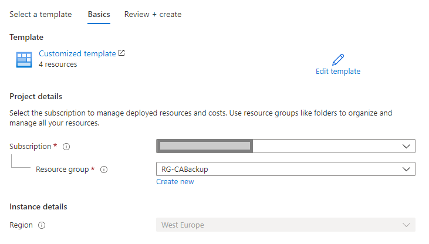

# Welcome to my CABackup solution.
You can find here the installation process for the whole solution.
The monthley fee for that solution (Microsoft consumption) is aprox 50€

<hr/>

#### 1. Okay let's start, to install the solution deploy the Azure storage account first:

That deployment includes the Azure storage account and the required Azure storage tables
* cabackup
* catranslation
* cabackupconfiguration

[](https://portal.azure.com/#create/Microsoft.Template/uri/https%3A%2F%2Fraw.githubusercontent.com%2FLagler-Gruener%2FSol-CABackupDeploy%2Fmain%2FStorageAccount%2Fdeploystorageaccount.json)

> #### Deployment input:
> <b style='color:red'>!IMPORTANT!</b> please select an existing resourcegroup or define a new one!



> #### Result:


<hr/>

#### 2. Next step is the user assigned managed identity deployment

That deployment step includes the Azure user assigned managed identits deployment, which is important for the whole solution.
Keep in mind, we have to copy the user assigned managed identity 'client id' when the deployment is finished!

[](https://portal.azure.com/#create/Microsoft.Template/uri/https%3A%2F%2Fraw.githubusercontent.com%2FLagler-Gruener%2FSol-CABackupDeploy%2Fmain%2FAzureMI%2Fdeploymanagedidentity.json)

> #### Deployment input:
> <b style='color:red'>!IMPORTANT!</b> please select the resource group created bevor


> #### Result:


> #### <b style='color:orange'>Now an important part!</b>
> <b>First,</b> please copy the output from the deployment, we need that information in the next steps!


> <b>Secound,</b> we have to assign the right permissions (least priviledge) to the Azure user assigned managed identity.

To do this, please open a powershell session on you PC (Az tools are reqired) or (in my case) 
open the Azure cloudshell (I love that feature and also recorded a <a href="https://www.youtube.com/watch?v=WrMJ0wPnEuw" target="_blank">YouTube video</a> about the configuration)

Okay I'm opening my Azure cloudshell and execute the following commands:

User.Read.All > für Change Policy!
Policy.Read.All > für das Daily backup!
Policy.ReadWrite.ConditionalAccess > für den restore!

```powershell
$permissions = @('User.Read.All','Policy.Read.All', 'Policy.ReadWrite.ConditionalAccess')

$GraphAppId = "00000003-0000-0000-c000-000000000000"
$GraphAppName = "CA-Backup"

Connect-AzureAD
$MSI = (Get-AzureADServicePrincipal -Filter "displayName eq '$GraphAppName'")
$GraphServicePrincipal = Get-AzureADServicePrincipal -Filter "appId eq '$GraphAppId'"

foreach($permissionname in $permissions){
$AppRole = $GraphServicePrincipal.AppRoles | Where-Object {$_.Value -eq $permissionname -and 
$_.AllowedMemberTypes -contains "Application"}

New-AzureAdServiceAppRoleAssignment -ObjectId $MSI.ObjectId -PrincipalId $MSI.ObjectId -ResourceId $GraphServicePrincipal.ObjectId -Id $AppRole.Id
}

```


<hr/>

#### 3. Now we can deploy the keyvault resource

That deployment step includes the Azure keyvault deployment, which is important for the Web Application.

[](https://portal.azure.com/#create/Microsoft.Template/uri/https%3A%2F%2Fraw.githubusercontent.com%2FLagler-Gruener%2FSol-CABackupDeploy%2Fmain%2FKeyVault%2Fdeploykeyvault.json)

> #### Deployment input:
> <b style='color:red'>!IMPORTANT!</b> <br/> 
> * Please select the resource group created bevor
> * Add the object id from the user assigned managed identity
> * Add the Azure storage account connection string


> You can find the Storageconnection string, when you open the deployed storage account and select the following:


> #### Result:


<hr/>

#### 4. Now we can deploy the Azure logic apps including the connectors

That deployment step includes the Azure logicapp and connectors deployment, which represent the basic infrastructure.

[](https://portal.azure.com/#create/Microsoft.Template/uri/https%3A%2F%2Fraw.githubusercontent.com%2FLagler-Gruener%2FSol-CABackupDeploy%2Fmain%2FLogicApp%2Fdeploylogicapps.json)

> #### Deployment input:
> <b style='color:red'>!IMPORTANT!</b> <br/> 
> * Please select the resource group created bevor


> #### Result:


> #### <b style='color:orange'>Now an important part!</b>
> Please enable the user assigned managed identity for all logic apps!

> <b>First step:</b> Enable the user assigned managed identity

First go to the LogicApp 'CA-Backup' and select on the left side the 'Identity' section and then the 'User assigned' option:


Then 'add' the user defined managed identity 'CA-Backup'.


> #### <b style='color:orange'>Important!</b>
> Please repeat the steps from above also on the LogicApp 'CA-Monitor-Changes' and 'CA-Restore'

> <b>Secound step:</b> Activate the two logicapp connectors. 

####To do this, select the connector <b>'azuretables'</b> first. 
On the top you'll see, that there is an issue with that connector, we will fix it now:


<br/>

When you've opened the selector, you can find on the left side the option 'Edit API connection':


<br/>
In the center screen you can see the two options 

* Storage Account Name
* Shared Storage Key

To fill out, please switch onece more to the storage account and copy the two configuration settings:

* Storage account name
* Key1


add the information to the connector and click on save.

#### Now we can go one step future and enable the <b>'office365'</b> connector.
It's the same process, please select the connector and then go to the option 'Edit API connection':


Click on 'Authorize' and login into your Office365 account.
> #### <b style='color:orange'>Important!</b>
> Please use an office365 enabled user to authentication including an exchange online mailbox!

<hr/>

#### 5. Now we can deploy the Azure log analytics workspace 

That deployment step includes the following services and configurations:

* Azure log analytics workspace deployment
* Azure active directory connection
* Alerting rule for conditional access policy changes including the required Action Group.

> #### <b style='color:orange'>Important!</b>
> Befor we can start with the deployment, we have to copy the HTTP URL from the 'CA-Monitor-Changes' LogicApp


[](https://portal.azure.com/#create/Microsoft.Template/uri/https%3A%2F%2Fraw.githubusercontent.com%2FLagler-Gruener%2FSol-CABackupDeploy%2Fmain%2FLogAnalytics%2Fdeployloganalytics.json)

