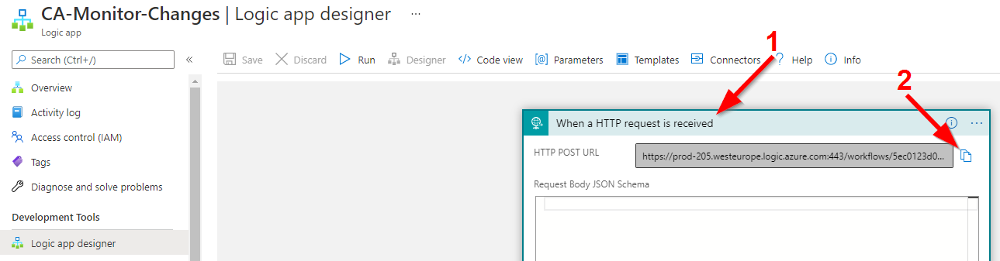
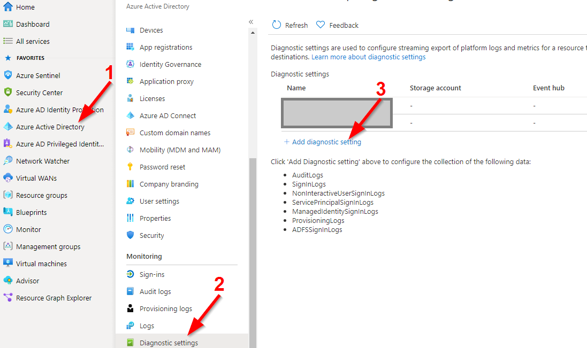
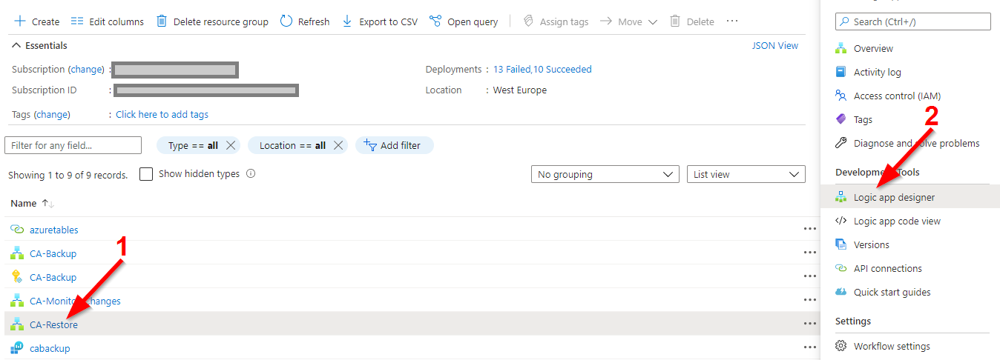
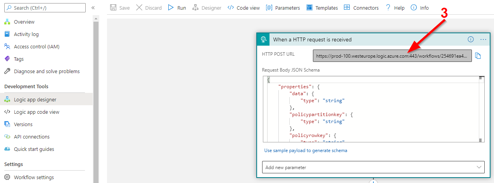

# Welcome to my CABackup solution GitHub repo.
You can find, the installation process for the whole solution here.
The fee for that solution (Microsoft consumption) amounts to aprox 50€/month

<hr/>

#### 1. Okay let's start. Deploy the Azure storage account first:

That deployment includes the Azure storage account and the required Azure storage tables

* cabackup
* catranslation
* cabackupconfiguration

[](https://portal.azure.com/#create/Microsoft.Template/uri/https%3A%2F%2Fraw.githubusercontent.com%2FLagler-Gruener%2FSol-CABackupDeploy%2Fmain%2FStorageAccount%2Fdeploystorageaccount.json)

> #### Deployment input:
> <b style='color:red'>!IMPORTANT!</b> please select an existing resource-group or define a new one!


> #### Result:


<hr/>

#### 2. Next, the user assigned managed identity deployment

That deployment step includes the Azure user assigned managed identits deployment, which is important for the whole solution.
Keep in mind, we have to copy the user assigned managed identity 'client id' when the deployment is finished! That information is required for the next steps.

[](https://portal.azure.com/#create/Microsoft.Template/uri/https%3A%2F%2Fraw.githubusercontent.com%2FLagler-Gruener%2FSol-CABackupDeploy%2Fmain%2FAzureMI%2Fdeploymanagedidentity.json)

> #### Deployment input:
> <b style='color:red'>!IMPORTANT!</b> please select the resource group created before.


> #### Result:


> #### <b style='color:orange'>Now an important part!</b>
> <b>First,</b> please copy the output from the deployment, we need that information for the next steps!


> <b>Secondly,</b> we have to assign the right permissions (least priviledge) to the Azure user assigned managed identity.

Here thepermission list for user assigned the managed identity

* User.Read.All > required for policy changes
* Policy.Read.All > required for the daily backup process
* Policy.ReadWrite.ConditionalAccess > required for the polica restore process

To do this, please open a powershell session on you PC (Az tools are reqired) or (in my case) 
open the Azure cloudshell (I love this feature and also have recorded a <a href="https://www.youtube.com/watch?v=WrMJ0wPnEuw" target="_blank">YouTube video</a> about the configuration and the usability)

Okay I'm opening my Azure cloudshell and execute the following commands:

```powershell
$permissions = @('User.Read.All','Policy.Read.All', 'Policy.ReadWrite.ConditionalAccess')

$GraphAppId = "00000003-0000-0000-c000-000000000000"
$GraphAppName = "CA-Backup"

Connect-AzureAD
$MSI = (Get-AzureADServicePrincipal -Filter "displayName eq '$GraphAppName'")
$GraphServicePrincipal = Get-AzureADServicePrincipal -Filter "appId eq '$GraphAppId'"

foreach($permissionname in $permissions){
$AppRole = $GraphServicePrincipal.AppRoles | Where-Object {$_.Value -eq $permissionname -and 
$_.AllowedMemberTypes -contains "Application"}

New-AzureAdServiceAppRoleAssignment -ObjectId $MSI.ObjectId -PrincipalId $MSI.ObjectId -ResourceId $GraphServicePrincipal.ObjectId -Id $AppRole.Id
}

```


<hr/>

#### 3. Now we can deploy the Azure keyvault resource

That deployment step includes the Azure keyvault deployment, which is important for the Web Application.

[](https://portal.azure.com/#create/Microsoft.Template/uri/https%3A%2F%2Fraw.githubusercontent.com%2FLagler-Gruener%2FSol-CABackupDeploy%2Fmain%2FKeyVault%2Fdeploykeyvault.json)

> #### Deployment input:
> <b style='color:red'>!IMPORTANT!</b> <br/> 
> * Please select the resource group created before
> * Add the object id from the user assigned managed identity
> * Add the Azure storage account connection string


> You can find the storage connection string, when you opening the deployed storage account and select the following:


> #### Result:


<hr/>

#### 4. Now we can deploy the Azure logic apps including the connectors

That deployment step includes the Azure 

* LogicApp 
* LogicApp connectors 

deployment, which represent the core solution.

[](https://portal.azure.com/#create/Microsoft.Template/uri/https%3A%2F%2Fraw.githubusercontent.com%2FLagler-Gruener%2FSol-CABackupDeploy%2Fmain%2FLogicApp%2Fdeploylogicapps.json)

> #### Deployment input:
> <b style='color:red'>!IMPORTANT!</b> <br/> 
> * Please select the resource-group created before


> #### Result:


> #### <b style='color:orange'>Now an important part!</b>
> Please enable the user assigned managed identity for all logic apps!

> <b>First:</b> Enable the user assigned managed identity

Go to the LogicApp 'CA-Backup' and select on the left side the 'Identity' section. Then select the 'User assigned' option:


Add the user defined managed identity 'CA-Backup'.


> #### <b style='color:orange'>Important!</b>
> Please repeat those steps from above, on the LogicApp 'CA-Monitor-Changes' and the 'CA-Restore' too.

> <b>Secound:</b> Activate the LogicApp connectors. 

#### To do this, select the connector <b>'azuretables'</b> first. 
On the top ofthe screen, you'll see, that there is an issue with that connector, we will fix that issue now:


<br/>

When you've opened the connector, you can find on the left side the option 'Edit API connection':


<br/>
At the center screen, you can see the two options 

* Storage Account Name
* Shared Storage Key

To fill out, please switch once more to the storage account, and copy the two configuration settings:

* Storage account name
* Key1


add the information to the connector and click on save.

#### Now we can go one step future and enable the <b>'office365'</b> connector.
It's the same process, please select the connector, and go to the option 'Edit API connection':


Click on 'Authorize' and login into your Office365 account.
> #### <b style='color:orange'>Important!</b>
> Please use an Office 365 enabled user, including an exchange online mailbox, for the authentication!

<hr/>


#### 5. Now we can deploy the Azure log analytics workspace 

That deployment step includes the following services and configurations:

* Azure log analytics workspace deployment
* Azure active directory connection
* Alerting rule for conditional access policy changes including the required Action Group.

> #### <b style='color:orange'>Important!</b>
> Befor we can start with the deployment, we have to copy the HTTP URL from the 'CA-Monitor-Changes' LogicApp.
> 
> <b>First,</b> please select the LogicApp 'CA-Monitor-Changes' and switch to the 'Logic app designer'


> Then select the trigger 'When a HTTP request is received' and copy the URL.



> Now we can start with the deployment

[](https://portal.azure.com/#create/Microsoft.Template/uri/https%3A%2F%2Fraw.githubusercontent.com%2FLagler-Gruener%2FSol-CABackupDeploy%2Fmain%2FLogAnalytics%2Fdeployloganalytics.json)

> #### Deployment input:
> <b style='color:red'>!IMPORTANT!</b> <br/> 
> * Please select the resource-group created before
> * Please past the URL to the 'Logic App_Changes_URL field


> #### Result:


> <b>Second:</b> the last step is the diagnostic setting enablement in Azure ad
> * Please open the Azure active directory service and switch to the diagnostic settings
> * Select 'Add diagnostic setting' to configure the events



> * Define a 'Diagnostic setting name' (for example CA-Backup)
> * Select 'AuditLogs'
> * Select the right Azure rescource group
> * Select the created Log Analytics Workspace 'cabackup'
> * Click on 'Save'


<hr/>

#### 6. The last step is the Azure webapp deployment 

That deployment step includes the following services and configurations:

* Azure app service plan deployment (S1, cheapest productive plan)
* Azure webapp deployment (.Net 4.8)
* Configure the webapp configuration settings
* Deploy the webapp from my GitHub repo

> <b style='color:red'>!IMPORTANT!</b> <br/> 
> Befor we start the deployment, we need two informations:
> * The KeyVault URL
> * The restore logicapp URL

> <b>First:</b> to find the keyvault URL open the keyvault and copy the Vault URI


> <b>Second:</b> to find the restore logicapp URL, open the logicapp 'CA-Restore', got to the 'Logic app designer', select the trigger 'When a HTTP request is received'and copy the URL.





> Okay great, now we can start with the deployment.

[](https://portal.azure.com/#create/Microsoft.Template/uri/https%3A%2F%2Fraw.githubusercontent.com%2FLagler-Gruener%2FSol-CABackupDeploy%2Fmain%2FWebApp%2Fdeploywebapp.json)

> #### Deployment input:
> <b style='color:red'>!IMPORTANT!</b> <br/> 
> * Please select the resource-group created before
> * Please past the keyvault URL to the 'Key Vault Name' field
> * Please past the logicapp URL to the 'Logic App_Restore_URL' field


